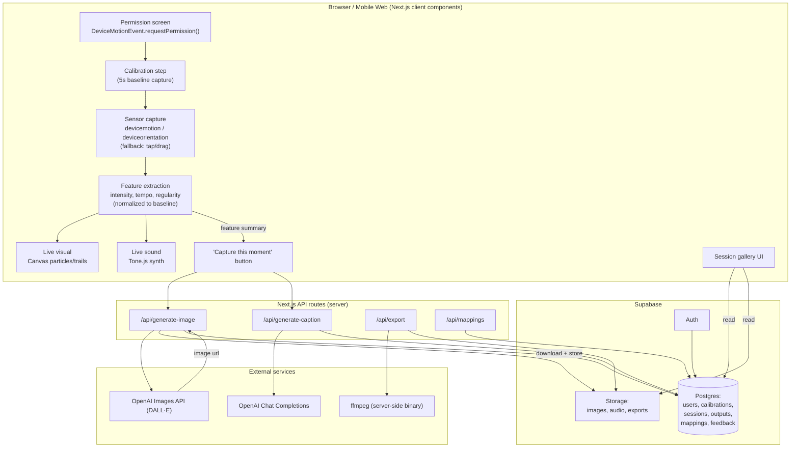

# StimuSonic — Architecture

## System diagram



## Design principle: live path vs. captured path

The architecture is deliberately split into two paths with different latency budgets:

- **Live path** (motion → visual/sound): entirely client-side, no network calls, no AI. Target <100ms. This carries the real-time "I did that" feeling and must never depend on an API response.
- **Captured path** (Capture button → image/caption/export): async, explicit user action, clear loading state, target <10s for image generation. AI latency is isolated here so it never breaks the live experience.

## Data flow detail

### 1. Permission + calibration
- Client requests motion permission inside a tap handler (iOS requirement).
- On grant, runs a 5s calibration capture of the user's natural gesture.
- Computes baseline peak amplitude + baseline tempo, stores in `calibrations` (Supabase), keyed to user/device.

### 2. Live feature extraction (runs continuously while "recording")
Computed client-side on a rolling window (e.g. last 2-3s of samples):
- `intensity` = peak/avg magnitude of acceleration vector, normalized against calibration baseline
- `tempo` = estimated repetitions per second via local-maxima/peak detection over the window
- `regularity` = variance of inter-peak intervals (low variance = steady, high = jerky)
- `classification` = simple thresholded label (bouncy / steady-wave / jerky / slow-rock) using *normalized* values from calibration, not fixed absolutes

These four values drive both the live visual (particle speed/color/spread) and live sound (Tone.js synth patch, scale, tempo) directly — no server round-trip.

### 3. Capture flow
- On "Capture," client sends a summary of the session's feature stream (not raw sensor data) to `/api/generate-image` and `/api/generate-caption`.
- `/api/generate-image`: builds a prompt template from features (e.g. "vibrant chaotic swirl of colors, high energy" for bouncy/high-intensity), calls OpenAI Images API, downloads the resulting image (DALL·E URLs expire), uploads to Supabase Storage, writes an `outputs` row linked to a `sessions` row.
- `/api/generate-caption`: same feature summary → short Chat Completions call → returns a 1-2 sentence reflective caption in plain language, stored alongside the output.
- Client shows a loading state until both resolve, then reveals image + caption + replays the captured audio pattern.

### 4. Export
- `/api/export` takes a session's stored image + a rendered audio clip (client renders the Tone.js pattern to an audio buffer and uploads it), combines them server-side with ffmpeg into a single video file, stores in Supabase Storage, returns a shareable/downloadable URL.

### 5. Personalization
- User can save the current feature range + chosen prompt style + synth style as a named `mappings` row.
- On future sessions, before falling back to default classification, the app checks if live features fall within a saved mapping's range and uses its style instead.

### 6. Feedback loop
- Simple thumbs up/down per output, stored in `feedback`, linked to `outputs`. Used only as a signal for future personalization — no complex ML this week.

## Supabase schema (minimal, week-scope)

```sql
users            -- Supabase Auth managed; or anonymous device-based id if skipping auth
calibrations     -- id, user_id, baseline_amplitude, baseline_tempo, created_at
sessions         -- id, user_id, started_at, duration_ms, feature_summary (jsonb: intensity, tempo, regularity, classification)
outputs          -- id, session_id, image_url, caption_text, audio_config (jsonb), export_url, created_at
mappings         -- id, user_id, label, feature_range (jsonb), prompt_style, synth_style, created_at
feedback         -- id, output_id, rating (thumbs up/down), created_at
```

RLS: each table scoped to `user_id = auth.uid()` (or device id if anonymous), so users only ever see their own sessions/gallery.

## Key technical risks and mitigations
- **iOS permission gating** → dedicated permission screen built and tested on real device day 1, not assumed.
- **DALL·E latency** → isolated to explicit Capture action, never in the live loop.
- **Per-user motion variance** → calibration step normalizes thresholds instead of hardcoding.
- **DALL·E URL expiry** → always download and re-host in Supabase Storage immediately after generation.
- **No mic/camera** → motion sensors only for the core product; mic is a separate opt-in stretch mode, clearly disclosed in consent.
